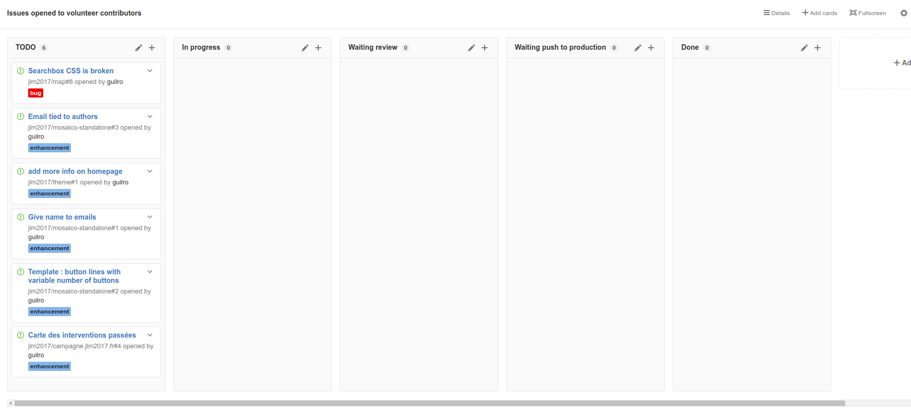

# Volunteers

Project for helping volunteer coders to contribute.

You can take any issue in any repository that is not assigned to another person.

There exists an organization-wide project "[Issues open to volunteer contributors](https://github.com/orgs/jlm2017/projects/2)". GitHub does not allow public organization project. You should request a membership to [JLM 2017 organization](https://github.com/jlm2017) to see the project. Contact [@guilrobis](https://twitter.com/guilrobis) or go to http://chat.coders.jlm2017.fr to request an invite.

## Contact

You can contact JLM 2017 team and other volunteers on http://chat.coders.jlm2017.fr. [@guilrobis](https://twitter.com/guilrobis) is the admin from the JLM 2017 staff.
